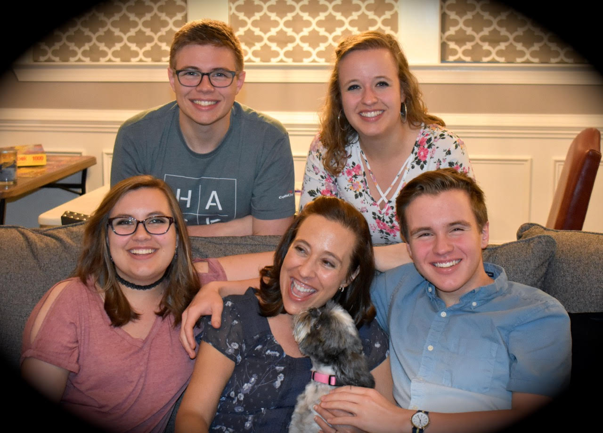
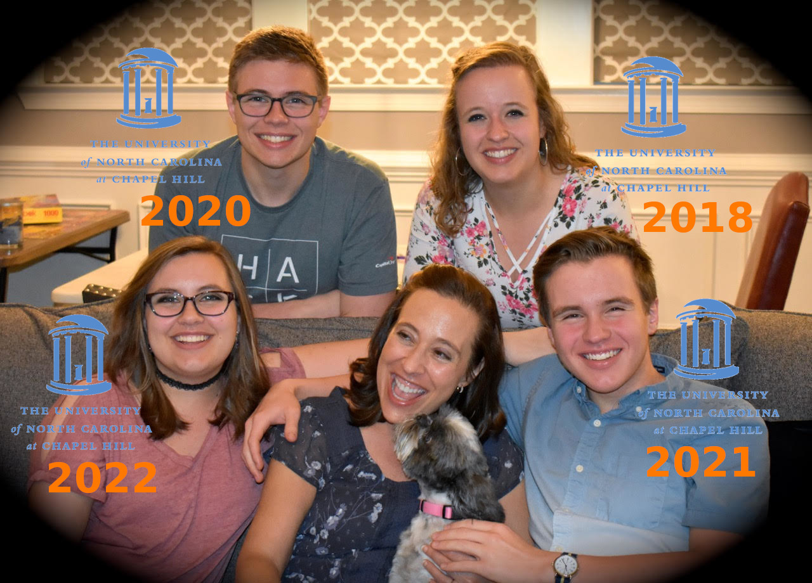
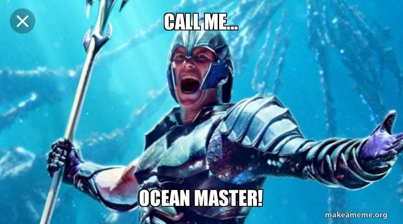

layout: true
name: inverse
class: center, middle, inverse

course: Secure Software Development
title: 00 Prelude
course: Secure Software Development
author: Jonathan Knudsen
email: jonathan.knudsen@duke.edu

---

# {{title}}

{{course}}

{{author}}

{{email}}

.copyright[

This work is licensed under a [Creative Commons Attribution-ShareAlike 4.0 International License](http://creativecommons.org/licenses/by-sa/4.0/).
]
---
layout: false

# My Family

.center[.image-70[]]

---

# My Family

.center[.image-70[]]

---

# My Work

.float[.image-40[]]

- Software developer

- Author

 - _Java 2D Graphics_
 
 - _Java Cryptography_
 
 - _The Unofficial Guide to Lego Mindstorms Robots_

- Principal Security Engineer

- Currently at Synopsys, Inc.

- [http://jonathanknudsen.com/](http://jonathanknudsen.com/)

---

# Bad News and Good News

.float[.image-30[]]

- [N00b](https://en.wikipedia.org/wiki/Newbie) to professorship

- What to call me?

 - Professor
 
 - Adjunct Assistant Professor
 
 - Jonathan
 
.image-50[]

---

# Jonathan's Bookmarks

- I'm not even that plugged in, but these keep me mostly up to date

- General technology news

 - Hacker News: https://news.ycombinator.com/

 - Slashdot: https://slashdot.org/

- Security

 - https://www.bleepingcomputer.com/
 
 - https://threatpost.com/
 
 - https://www.darkreading.com/

---

# About This Course

- For future developers, future development managers, security engineers, etc.

- Partly about process, partly about techniques and tools

- Learn by doing

- 13 weeks, ~2.5 hours per week

 - 1.25 hours lecture
 
 - 1.25 hours workshop

---
class: whitey
background-image: url(images/matrix-hacker.png)

# I Will Not Make You a Hacker

- We will talk about vulnerabilities

- We will talk not so much about exploits and breaches

- Focus of the class is finding vulnerabilities and fixing  them before bad people can exploit them

---

# I Will Make You a Security Champion

.float[.image-50[]]

- Someone who knows the way things should be

- Someone who can envision a better world

- Someone who works to move toward that world

---
template: inverse

# Syllabus

---

# Expectations

- Courtesy and respect

- Duke Community Standard

- Do your own work

- Small excerpts, with proper attribution, are acceptable

---

# Ethical Hacking

- Some of this is dangerous

- Don't break other people's stuff

- Don't break into other people's stuff

- Testing happens in your private lab environment

- _Responsible disclosure_

 - If you find a vulnerability, don't make it public immediately
 
 - Communicate with developers to give them a chance to respond
