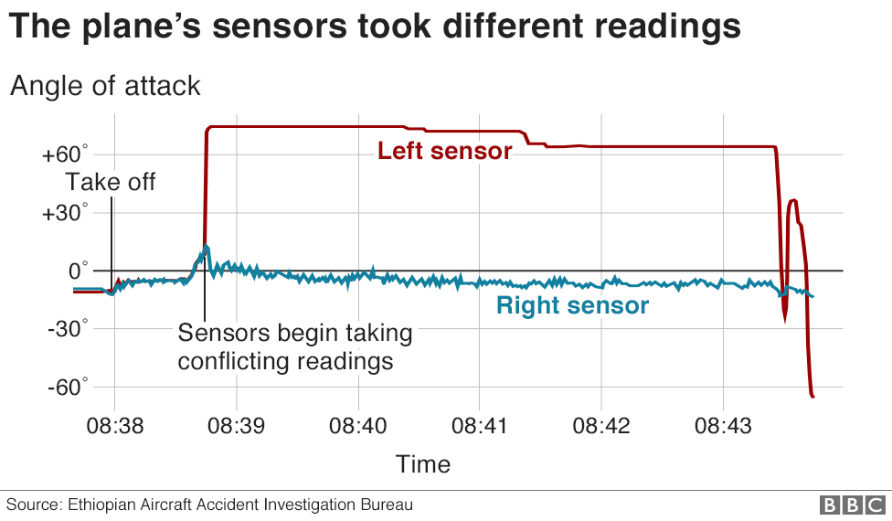
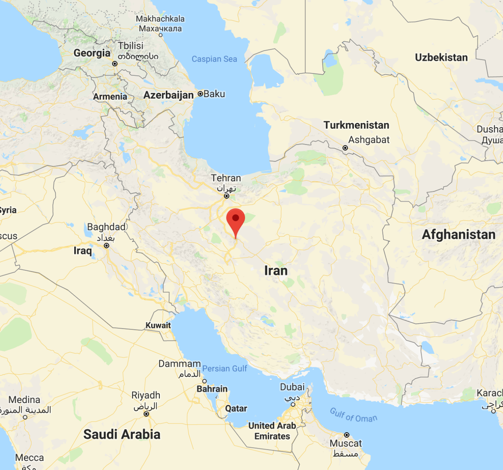
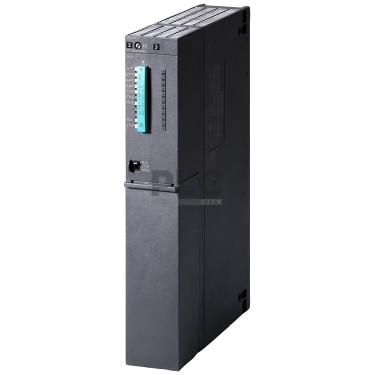
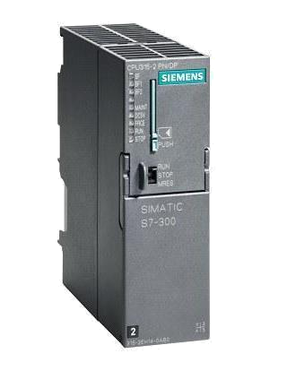

name: inverse
layout: true
class: center, middle, inverse

course: Secure Software Development
title: 01w Story Time
course: Secure Software Development
author: Jonathan Knudsen
email: jonathan.knudsen@duke.edu

---

# {{title}}

{{course}}

{{author}}

{{email}}

.copyright[


This work is licensed under a [Creative Commons Attribution-ShareAlike 4.0 International License](http://creativecommons.org/licenses/by-sa/4.0/).
]

---
layout: false

# Outline

- Software Matters

- Stuxnet

- CVE-2017-0144

---
template: inverse

# Software Matters

## Boeing 737 Max MCAS
 
---

# Flying is Very Safe

- "Modern airlines are statistically very, very safe." - [James Fallows (2019)](https://www.theatlantic.com/ideas/archive/2019/03/et302-boeing-737-max-8-blame/584572/)

- Basically the system works

- But not in this case, and software was a critical component

- October 29, 2018: Lion 610 crashes in Indonesia, killing all aboard (189)

- March 10, 2019: Ethiopian 302 crashes in Ethiopia, killing all aboard (157)

---

# Many Ingredients in the Soup

- Boeing wanted to deliver 737 Max, a bigger 737

- More powerful and efficient engines
 
- Larger engines make the plane handle differently

- _Really_ wanted it to be an incremental change from 737

 - FAA certification of a new design is very expensive
 
 - Training pilots and crew on a new design is expensive

- FAA might defer to Boeing engineers to certify safety

---

# MCAS

- Boeing added a system, MCAS, to avoid stalls

- Two sensors for pitch angle, one on either side of the airplane

- One computer for each sensor, only one active at a time

- If pitch gets too big, computer pushes the pilot's control column forward to bring the nose down

- Pseudocode looks like this:

```c
int aoa = get_active_aoa_sensor();
if (aoa > 15)
  runaway_trim();
```

---

# The Problem

.float[.image-50[]]

- Code only looks at one sensor

- Code does not consider failure modes

- When the pitch sensor fails

 - When it's on the active side
 
 - Angle of attack gets reported at a nonsensical value
  
 - MCAS pushes the nose of the plan down inexorably

---

# Possible Improvements

- Reject nonsensical sensor values

```c
int aoa = get_active_aoa_sensor();
if (aoa > 15 && aoa < 25)
  runaway_trim();
```

- Consider the input of both sensors

```c
int aoa = get_average_aoa();
if (aoa > 15 && aoa < 25)
  runaway_trim();
```

---

# Morals of This Story

- Never, ever, _ever_ trust input

- Ever

- For developers, code defensively

- For product teams

 - _More_ testing and _better_ testing

 - Always be thinking about security (spoiler: SDLC)
 
---

# References

https://spectrum.ieee.org/aerospace/aviation/how-the-boeing-737-max-disaster-looks-to-a-software-developer

https://philip.greenspun.com/blog/2019/04/08/boeing-737-max-crash-and-the-rejection-of-ridiculous-data/

https://www.bbc.com/news/world-africa-47553174

James Fallows, including:

- https://www.theatlantic.com/notes/2019/03/3-implications-737-max-crashes/585034/
- https://www.theatlantic.com/ideas/archive/2019/03/et302-boeing-737-max-8-blame/584572/

https://en.wikipedia.org/wiki/Aviation_safety

https://en.wikipedia.org/wiki/List_of_accidents_and_incidents_involving_the_Boeing_737

---
template: inverse

# Stuxnet

## Weaponized Software

---

# Stuxnet in a Nutshell

.float[.image-40[]]

- First publicly known cyber weapon

- Sophisticated malware designed to delay Iran’s development of nuclear weapons

- Target was uranium enrichment plant in Natanz

- First release probably in 2007

- Discovery in June 2010

---

# Attribution

- Jointly developed by the United States and Israel

 - Code-named “Olympic Games”

- Development started during George W. Bush administration

- Development and deployment continued under Obama administration

---

# Initial Infection

- Natanz facility was on an isolated or “air-gapped” network

- Five Natanz suppliers were infected

- An infected USB drive or laptop brought the infection inside the Natanz network

- Stolen software certificates made software appear legitimate

---

# Spread Within Facility

- Stuxnet exploited zero-day vulnerabilities in Windows

- One allowed the infection to spread via USB memory drives

- One allowed the infection to spread over the network via a Print Spooler vulnerability

- Stuxnet looked for Siemens Step7 software with attached industrial controllers (Programmable Logic Controllers, or PLCs)

- Second attack “escaped” Natanz and spread worldwide

---

# Targets

- Spread among Windows computers

- Compromised attached Siemens Programmable Logic Controllers (PLCs)

- PLCs controlled centrifuges

- Stuxnet code on PLCs made operation appear normal while attack was executed

---

# Payload 1: Overpressure Attack

.float[.image-40[]]

- First attack used detailed knowledge of Natanz configuration

- Attacked Siemens S7-417 controllers

- Closed exhaust valve to increase pressure to damage centrifuges

- Carefully designed to cause damage, but not enough to be noticed

---

# Payload 2: Speed Attack

.float[.image-30[]]

- Second attack was less stealthy, and even contained the unused first attack code

- Attacked Siemens S7-315 controllers

- Spun centrifuges up and down, working through damaging harmonics

- Caused damage with little regard for being noticed

---

# Why is Stuxnet Special? (1 of 5)

## Four Windows 0day Vulnerabilities

- Zero-day vulnerabilities are rare and powerful

- A typical malware might exploit known vulnerabilities

- Higher-end malware might exploit a single zero-day

- Using four zero-day exploits, against Windows itself, is highly unusual

- Zero-days are difficult to find or expensive to purchase

 - Enabled rapid spread via USB drives and network

 - Undetectable by antivirus

---

# Why is Stuxnet Special? (2 of 5)

## Size

- Typical malware is 10kB to 15kB

- Stuxnet is unusually large: 500 kB

- Size was not unnecessary

 - Stuxnet contained multiple layers to exploit the Natanz facility

 - Functionality made operations appear normal while the attack was progressing

---

# Why is Stuxnet Special? (3 of 5)

## Stolen Certificates

- A certificate provides assurance that software is from a legitimate source

- At first, Stuxnet used a certificate stolen from RealTek Semiconductor

 - RealTek is a Taiwanese hardware company

 - When researchers noticed the stolen certificate, it was revoked

- Stuxnet then switched to use a certificate stolen from JMicron Technology

 - JMicron is a Taiwanese hardware company, located in the same office part as RealTek

---

# Why is Stuxnet Special? (4 of 5)

## Exploits Within Exploits

- Stuxnet contained knowledge and code to compromise an entire facility

- Normal malware has exploit code for one target platform

- Stuxnet had exploit code for Windows and also for Siemens PLCs

- PLC exploits were especially clever

 - Decoupled the original code from inputs and outputs, but kept it running

 - Changed behavior, but made everything appear normal

---

# Why is Stuxnet Special? (5 of 5)

## Robust Intelligence Support

- Exploits were designed with highly detailed knowledge of the inner workings at Natanz

- Attacks took advantage of very specific configurations of centrifuges

- Initial incursion occurred through compromised Natanz contractors

- Somebody had to steal those certificates

---

# Final Result

- Destroyed about 20% of Iran’s centrifuges

- Delayed Iran’s nuclear program by 18 to 24 months

---

# Consequences

- Stuxnet is the first publicly known cyber-physical weapon

 - Flame, a Stuxnet cousin, evaded detection until May 2012

 - Duqu, also related, might have stolen the certificates used by Stuxnet

- Revealed to the world the sophistication and potential for cyber weapons

- Demonstrated US dominance in offensive cyber capabilities

- Stuxnet set a precedent for nation-state behavior in the cyber world

---

# References

Fingas, J. (2014, November 13). Stuxnet worm entered Iran's nuclear facilities through hacked suppliers. Engadget. https://www.engadget.com/2014/11/13/stuxnet-worm-targeted-companies-first/

Kelley, M. (2013, November 20). The Stuxnet Attack On Iran's Nuclear Plant Was 'Far More Dangerous' Than Previously Thought. Business Inside. Retrieved from https://www.businessinsider.com/stuxnet-was-far-more-dangerous-than-previous-thought-2013-11

Kushner, D. (2013, February 26). The Real Story of Stuxnet. IEEE Spectrum. Retrieved from https://spectrum.ieee.org/telecom/security/the-real-story-of-stuxnet

Langner, R. (2013, November). To Kill a Centrifuge. https://www.langner.com/wp-content/uploads/2017/03/to-kill-a-centrifuge.pdf

Sanger, D. (2012, June 1). Obama Order Sped Up Wave of Cyberattacks Against Iran. The New York Times. https://www.nytimes.com/2012/06/01/world/middleeast/obama-ordered-wave-of-cyberattacks-against-iran.html

Zetter, K. (2011, July 11). How Digital Detectives Deciphered Stuxnet, the Most Menacing Malware in History. Wired. Retrieved from https://www.wired.com/2011/07/how-digital-detectives-deciphered-stuxnet/
---
template: inverse

# CVE-2017-0144

## A Parade of Oops

---

# The Vulnerability

- Affects most versions of Windows, ~2012 - 2017

- Specifically, it is a vulnerability in the file sharing protocol SMBv1

- Buffer overflow leads to a math error

- Can be exploited, by delivering crafted input, for remote code execution (RCE)

- Windows File Sharing is usually on

- Allows building a _worm_ (spoiler alert)

---

# Timeline

- ~2012: 0day is located and exploited by Equation Group (NSA) .red[*]

.footnote[
.red[\* Oops]
]

--

- ~2012: Equation Group starts using ETERNALBLUE exploit

--

- 14 March 2017: Microsoft patches CVE-2017-0144 and other vulnerabilities

--

- 14 April 2017: Shadow Brokers discloses Equation Group tools, including ETERNALBLUE  .red[*]

--

- Shortly thereafter: North Korea creates WannaCry ransomware using ETERNALBLUE

--

- 12 May 2017: WannaCry ransomware infects 230,000 computers worldwide

--

- ...later that day: researcher Marcus Hutchins, a.k.a. MalwareTech, inadvertantly flips kill switch  .red[*]

---

# WannaCry Costs

- Britain's National Health Service (NHS) got hit hard

--

 - Estimated cost: $100 million

--

- Worldwide

--

 - Estimated cost: $4 billion

--

- Marcus Hutchins' cost to shut down WannaCry

--

 - About $10

---

# Patches

- After earlier Shadow Brokers disclosures, NSA notified Microsoft about vulnerabilities

- Microsoft patches CVE-2017-0144 and other vulnerabilities in March 2017

- But people are slow to upgrade, or won't if they don't have to

---

# Unanswered Questions

- But really, what is the overall cost of CVE-2017-0144?

 - Impossible to know

 - How often did the US use ETERNALBLUE? What did they do with it?

- What if WannaCry got to run wild for more than just a few hours?

---

# An Ethical Issue: Hoarding Vulnerabilities

- NSA and other intelligence agencies are criticized for stockpiling 0days

- NSA uses them as tools to further US national interests

- ...but the rest of us are vulnerable to 0days

- ...and if the NSA can't keep its stuff secret, we have big trouble

---

# References (1 of 2)

https://nvd.nist.gov/vuln/detail/CVE-2017-0144

https://blog.checkpoint.com/2017/05/25/brokers-shadows-analyzing-vulnerabilities-attacks-spawned-leaked-nsa-hacking-tools/

https://www.cbsnews.com/news/wannacry-ransomware-attacks-wannacry-virus-losses/

https://www.datto.com/blog/ransomware-news-wannacry-attack-costs-nhs-over-100-million

https://abcnews.go.com/US/timeline-wannacry-cyberattack/story?id=47416785

https://www.wired.com/2017/05/accidental-kill-switch-slowed-fridays-massive-ransomware-attack/

https://en.wikipedia.org/wiki/WannaCry_ransomware_attack

---

# References (2 of 2)

https://arstechnica.com/information-technology/2017/05/an-nsa-derived-ransomware-worm-is-shutting-down-computers-worldwide/

https://docs.microsoft.com/en-us/security-updates/securitybulletins/2017/ms17-010

https://www.washingtonpost.com/business/technology/nsa-officials-worried-about-the-day-its-potent-hacking-tool-would-get-loose-then-it-did/2017/05/16/50670b16-3978-11e7-a058-ddbb23c75d82_story.html

https://en.wikipedia.org/wiki/EternalBlue

https://www.kaspersky.com/about/press-releases/2015_equation-group-the-crown-creator-of-cyber-espionage

https://securelist.com/equation-the-death-star-of-malware-galaxy/68750/

