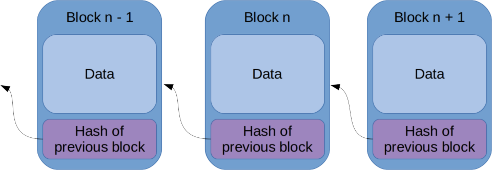
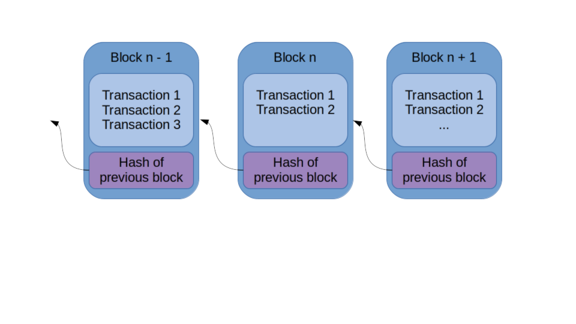
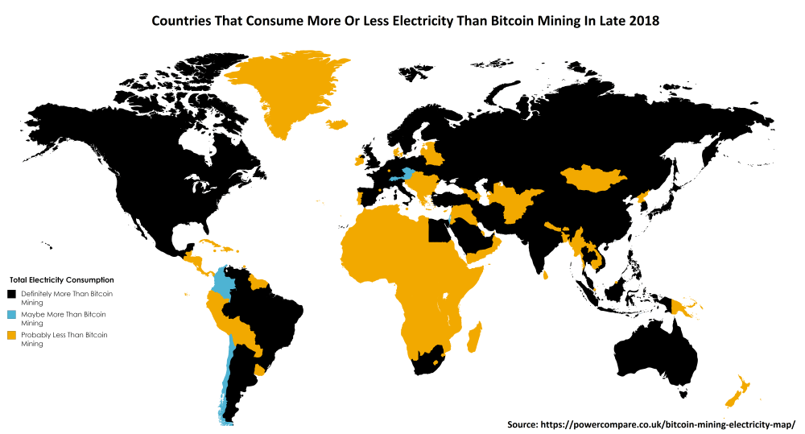
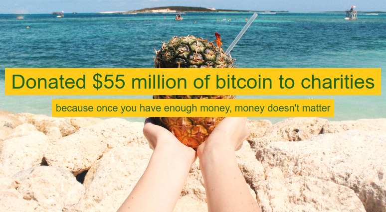
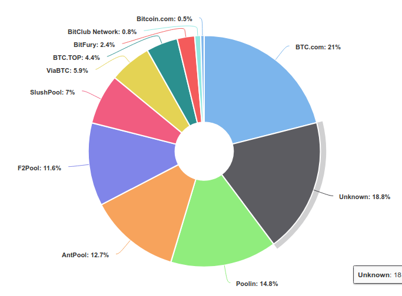

name: inverse
layout: true
class: center, middle, inverse

course: Secure Software Development
title: 04 Blockchain
author: Jonathan Knudsen
email: jonathan.knudsen@duke.edu

---

# {{title}}

{{course}}

{{author}}

{{email}}

.copyright[

This work is licensed under a [Creative Commons Attribution-ShareAlike 4.0 International License](http://creativecommons.org/licenses/by-sa/4.0/).
]

---
layout: false

# Outline

- Blockchain

- Cryptocurrency

- Some Numbers

- Economics

- Bitcoin

- Ethereum

- Libra

- De-decentralization

---

template: inverse

# Blockchain

---

# Blockchain

- A _blockchain_ is...a data structure

.center[.image-90[]]

- Verify by working backwards

- Great for preserving _integrity_

---

# The Genesis Block

.float[.image-50[]]

- In the beginning...

- The previous hash field is just zero

- Everybody knows the genesis block, kind of like how everybody knows the self-signed CA root certificates

---

# Blockchain + Transacations = Ledger

- But still, it's just a data structure

.center[.image-90[]]

---

template: inverse

# Cryptocurrency

## a.k.a. Distributed Ledger Technology

## a.k.a. Blockchain

---

# A Cryptocurrency is Many Things

- Yes, a blockchain ledger

- Distributed system

- Decentralized (peer-to-peer) system

- Trustless

- Discovery mechanism

- Consensus mechanism

- A _reference implementation_, i.e. code

--

- ...complicated!

---

# A Cryptocurrency is Distributed

- _Distributed systems_ is a whole area of computer science

- In simplest terms, it means performing one task across multiple systems

- Easiest topology is master / slave

 - The master directs the slaves to perform bits of the work

- But the more interesting distributed computing is peer-to-peer (p2p)

 - No one system is in charge

 - Peers, or _nodes_, coordinate amongst themselves to get stuff done and agree on the state of the system

- In cryptocurrencies:

 - Keep a copy of the ledger on every node

 - All nodes use the same rules

---

# A Cryptocurrency is Decentralized

- A critical mantra of the cryptocurrency crowd

- The network has no central point of control or failure

 - Nodes (peers) can come and go

 - Properly executed, makes a very resilient system

- Not only technologically, but ideologically also

 - Development happens in the open

 - New directions and features are allegedly community-driven

 - No big corporation pulling the strings

 - No government pulling the strings

 - Some degree of anonymity

---

# A Cryptocurrency is Trustless

- Not only p2p, but you don't have to trust your peers

- You trust the system

- Set up carrots and sticks to reward good behavior

- Define the rules very carefully

---

# A Cryptocurrency has a Discovery Mechanism

- How do nodes find each other?

- Bitcoin: [Satoshi Client Discovery](https://en.bitcoin.it/wiki/Satoshi_Client_Node_Discovery)

- Ethereum: [Node Discovery Protocol](https://github.com/ethereum/devp2p/blob/master/discv4.md)

 - A "Kademlia-like DHT," as if that makes things clearer

---

# A Cryptocurrency has a Consensus Mechanism

- The blockchain is the state of the system

- How do nodes agree on the next block, i.e. the new state of the system?

---
# A Cryptocurrency has a Reference Implementation

- This is some body of code that implements the specifications

- Developed in the open so everyone can see

- Is software like any other software

 - Subject to vulnerabilities

 - Must be developed very carefully

---

# Accounts

- We're back to public-key cryptography here

- An "account" is represented by a key pair

- You keep the private key safe, and it is the only way to work with your "coins"

- Others can send coins to you via your public key

---

template: inverse

# Some Numbers

---

# Market Capitalizations

- From https://coinmarketcap.com/ on 16 September 2019

.center[.image-100[]]

---

# Bitcoin Numbers

- In Q2 2019, blockchain is 226GB

 - https://www.statista.com/statistics/647523/worldwide-bitcoin-blockchain-size/

- Average block size is .88MB, with about 326k transactions per day (16 September 2019)

 - https://www.blockchain.com/en/charts

- Target is one new block every ten minutes, and system adjusts to meet this target

 - https://en.bitcoin.it/wiki/Block

- [~8,700 Bitcoin nodes worldwide](https://bitnodes.earn.com/)

- Bitcoin mining consumes more electricity than many countries

- Exactly 14 days ago (5 September 2019), somebody transferred 94,504 Bitcoin (over 1 billion USD) from one account to another

 - https://blockstream.info/tx/4410c8d14ff9f87ceeed1d65cb58e7c7b2422b2d7529afc675208ce2ce09ed7d

- https://www.forbes.com/sites/billybambrough/2019/09/15/bitcoin-ethereum-ripples-xrp-and-litecoin-could-be-heading-into-their-biggest-week-ever/

---

template: inverse

# Economics

--

## It's Not My Jam

---

# Why do Cryptocurrencies Have Value?

.float[.image-30[]]

- ...because we _believe_

- ...same as anything else

- National currencies are also powered by faith

---

# Currency or Commodity?

- The debate rages on

- A court case in 2018 says commodity

- 

- ...but really, does it matter?

 - To regulators, yes

---

template: inverse

# Bitcoin

---

# Origin Story

- 2008 paper by "Satoshi Nakmoto"

 - https://bitcoin.org/bitcoin.pdf

- We still don't know Satoshi's real identity

- Built on various pieces of previous work

- But truly innovative

---

# Oldest and Biggest

- Has worked its way into network television dramas as an "untraceable" payment mechanism

- You'll see Bitcoin accounts listed in places that take donations, like open source projects

- Bitcoin payments are popular with ransomware authors

- Uses ECDSA for key pairs and cryptographic signatures

- SHA-256 for hashing

---

# Mining

- Proof of Work

- Take transactions, wrap them up in a block

- Then adjust nonce and compute hash

- Repeat until you get a hash that starts with some number of zeros

- When you find this nonce, the block is mined and gets added to the blockchain

- If you mined the block, you get some Bitcoin

---

# Hash Power

.float[.image-50[]]

- The faster you can compute hashes, the more likely you are to mine a block

- ASICs!

- Power!

- Centralized distributed systems

---

# THATSALOTTADAMAGE

.center[.image-90[]]

---

# Plenty of Copies and Derivatives

- See https://mapofcoins.com/bitcoin/

---

.float[.image-15[]]

# Bitcoin Fails

- Mt. Gox (March 2014 -ish)

 - "Lost" nearly 750k Bitcoins, worth about $473 million at the time

 - "Found" almost 200k Bitcoins later

 - Filed for bankruptcy

- [BitFloor](https://www.cnet.com/news/bitcoin-exchange-bitfloor-shuttered-after-virtual-heist/) (September 2012)

 - About $249 million

 - Caused BitFloor to close

- https://bigthink.com/reuben-jackson/bitcoin-burglaries-the-5-biggest-cryptocurrency-heists-in-history

---

# ...and Something Funny!

- Among a million other cryptocurrencies...

.center[.image-30[]]

- [DogeCoin](https://en.wikipedia.org/wiki/Dogecoin), which is a spinoff of [LiteCoin](https://en.wikipedia.org/wiki/Litecoin), which is a 2011 fork of Bitcoin

.footnote[Image By Source (WP:NFCC#4), Fair use, https://en.wikipedia.org/w/index.php?curid=56259266]

---

# ...and Something Nice!

.center[.image-70[]]

- https://pineapplefund.org/

---

template: inverse

# Sprint 1 (10 minutes)

Find an interesting cryptocurrency or other blockchain-related project

Prepare a 60-second speech

---
template: inverse

# Ethereum

---

# Algorithms

- Uses ECDSA for key pairs and cryptographic signatures

- Keccak-256 for hashing (not quite SHA-3)

---

# Why Not?

.float[.image-50[]]

- Why not put code on the blockchain?

- Why not dream up a VM to run it?

- Why not dream up an entirely new programming language?

---

# Smart Contracts (dApps) and the Ethereum World Computer

- Program in Solidity, `solc` compiles to EVM bytecode

- Other languages exist, but haven't thrived

- Bytecode goes into the blockchain, gets its own address

- Use _gas_ to make things run

 - Pay for computing resources, per opcode, per storage

 - Solves the _halting problem_, i.e. prevents infinite loops

- Every node runs its own EVM and runs contract transactions

---

# Tokens

- _Tokens_ are cryptocurrencies implemented on top of Ethereum

- A standard for tokens is [ERC-20](https://en.wikipedia.org/wiki/ERC-20)

- ERC-20 specifies methods that should be implemented

- Tons of tokens are out there: see https://eidoo.io/erc20-tokens-list

---

# Ethereum Fails

.float[.image-50[]]

- [The DAO](https://en.wikipedia.org/wiki/The_DAO_%28organization%29) (June 2016)

 - Re-entrancy bug (woopsie daisy)

 - About $50 million

 - Community moved for a _hard fork_

 - Original chain is now Ethereum Classic

- [Parity multi-signature wallet](https://www.freecodecamp.org/news/a-hacker-stole-31m-of-ether-how-it-happened-and-what-it-means-for-ethereum-9e5dc29e33ce/) (July 2017)

 - Fallback method bug (woopsie daisy)

 - About $31 million

 - White hats saw the heist in progress, then exploited the same vulnerability to steal the rest of the funds before the attacker

---

template: inverse

# Sprint 2 (10 minutes)

Find an interesting Ethereum smart contract

Prepare a 60-second speech

---

template: inverse

# Libra

---

# What Could Go Wrong?

- ~~Facebook~~ Libra Foundation is trying to create a global cryptocurrency

- https://libra.org/en-US/

- [US says WTF?](https://techcrunch.com/2019/07/16/libra-in-messenger-whatsapp/)

- [France and Germany say "no"](https://www.reuters.com/article/us-facebook-cryptocurrency-france-german/france-and-germany-agree-to-block-facebooks-libra-idUSKCN1VY1XU)

- See also https://foreignpolicy.com/2019/06/24/971554-facebook-bitcoin-libra-crypto-bad/

---

template: inverse

# De-decentralization

---

# When You Try Your Best But You Don't Succeed

- Centralization seems to happen regardless

- https://hackernoon.com/decentralizing-everything-never-seems-to-work-2bb0461bd168

---

# Bitcoin Mining Coagulation

.center[.image-50[]]

- Source: https://www.blockchain.com/en/pools (18 September 2019)

---

# Inventor of Ethereum

.center[.image-50[]]

- [Vitalik Buterin](https://en.wikipedia.org/wiki/Vitalik_Buterin)

- Published the first paper about Ethereum in 2013, when he was 19

---

# Exchanges

- Obviously a central aggregator of value

- Obviously a prime target for attacks

- Obviously a focus for regulators

---

template: inverse

# Swerve

---

# And Then We Have This

- https://www.vice.com/en_us/article/j5y5ed/billionaire-linkedin-founder-thinks-bitcoin-rap-battle-will-heal-divided-nation

 - Hamilton versus Satoshi rap battle, yo: https://youtu.be/JaMJi1_1tkA

.center[.image-50[]]

---

# And This

- https://symphony.iohk.io/

---

template:inverse

# Exploring Ethereum

Tour of https://etherscan.io/

Tour of https://remix.ethereum.org/

