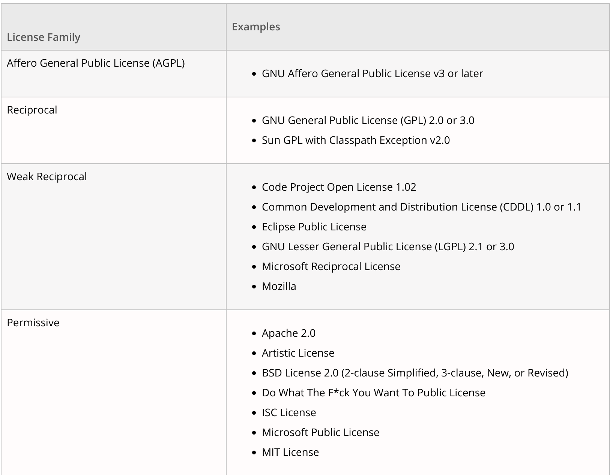

layout: true
class: center, middle, inverse
name: inverse

course: Secure Software Development
title: 06 Supply Chain
course: Secure Software Development
author: Jonathan Knudsen
email: jonathan.knudsen@duke.edu

---

# {{title}}

{{course}}

{{author}}

{{email}}

.copyright[


This work is licensed under a [Creative Commons Attribution-ShareAlike 4.0 International License](http://creativecommons.org/licenses/by-sa/4.0/).
]
---
layout: false

# Outline

- Software is assembled

- Vulnz

- Workshop: BDBA

- Strategies

- Licenses

- Workshop: Black Duck

- Lessons Learned

---
template: inverse

# Software is Assembled

---

# Third-Party Components

- Open source components

 - Source code is freely available, often at Github
 
 - Usage is governed by a _license_
 
- Proprietary components

 - Also called _closed source_
 
 - Usage is governed by a license

- Software has a Bill of Materials (BOM), just like in traditional manufacturing

- BOM must be managed

---

# Heartbleed

- Serious vulnerability in openssl versions 1.0.1 - 1.0.1f

- Wandered the wild from March 2012 until April 2014

- Easily exploitable on any public web server

- Organizations worldwide struggled to answer fundamental questions

 - IT security: which products are we using that have a vulnerable openssl?
 
 - Product security: which of our products use a vulnerable openssl?

---

# Risks of Third-Party Components

- Known Vulnerabilities (CVEs)

 - At build time
 
 - During deployment / maintenance

- Unknown Vulnerabilities

- Licenses

 - Conflicts with your product license
 
 - Incompatible licenses on components

---

# Nested Components

- Components might contain other components

- Each component has its own license and terms

---

# How Components Get Used

- Source code

 - Part of the repository tree (changed?)
 
 - Downloaded and built during the build

- Binary

 - Static linking
 
 - Dynamic linking

- Build systems like Gradle or Maven

---

# What Developers See

.center[.image-50[]]

---

# What Lawyers See

.center[.image-60[]]

---
template: inverse

# Vulnz

Because everything is better spelled with a z

---

# Remember NVD

- National Vulnerability Database: https://nvd.nist.gov/

- Provides useful information, in a structured, machine-readable format

- (Search for "microsoft word" or "tesla" or "whatsapp")

---

# Digging Deeper into Vulnerabilities: CVSS

.float[.image-50[]]

- Like _Whose Line Is It Anyway_, the points don't matter

- [Common Vulnerability Scoring System](https://en.wikipedia.org/wiki/Common_Vulnerability_Scoring_System)

- Measures the _severity_ of a vulnerability

- A number from 0 to 10

- Easy, right?

--

- No

---

# Problems with CVSS

- Different people will come up with different scores

 - Too much wiggle room in the definitions

- Scores are too complicated

 - Few people really know CVSS

- More than one version of CVSS

- Nevertheless, it is the system we have

 - Used for risk decisions
 
---

# CVSS v2

- https://www.first.org/cvss/v2/guide

- https://nvd.nist.gov/vuln-metrics/cvss/v2-calculator

- How would you score this one?

 - https://awakened1712.github.io/hacking/hacking-whatsapp-gif-rce/

---

# CVSS v3

- https://www.first.org/cvss/user-guide

- https://nvd.nist.gov/vuln-metrics/cvss/v3-calculator

- How would you score this one?

 - https://awakened1712.github.io/hacking/hacking-whatsapp-gif-rce/

---

# We Can Do Better Than NVD, but It's Expensive

- Accuracy

- Speed

- NVD Numbering Authorities (NA)

---

# Code Rot

- The CVEs just keep a-coming

- Usually: "if it ain't broke, don't fix it"

- In software: "if it ain't broke, it will be soon"

- Slide 13: [You Can't Make a Good Omelette with Rotten Eggs](https://prodduke-my.sharepoint.com/:p:/g/personal/jk471_duke_edu/ERtXI8pQZtpAui33sjjmxrkBxPcTjnl19PEKESIzvSCFlg?e=EKfUNy)


---
template: inverse

# Workshop: BDBA

---
template: inverse

# Strategies

Finding da BOM

---

# Excel

- Big yike

- Completely manual

- Some downtrodden product manager attempts to keep up to date with what developers are doing

- Nearly impossible to maintain

---

# Source Analysis

- File matching, partial file matching

- Tons of edge cases

 - What if 17 files match but the 18th doesn't?
 
 - What if the license file is different than the license we thought the component had?

---

# Binary Analysis

- What's a _binary_?

 - ELF on Linux, PE on Windows
 
 - Also Java class files, .NET CLR files
 
 - Doesn't really exist for Python, Ruby, other interpreted languages

- Recursively unpack archives of all sorts

- Pull out strings from binaries

- Compare to previously compiled database of components

- Static linking and dynamic linking make a difference

---

# Build System Analysis

- Build system might pull in third-party components

- For example, Maven or Gradle in the Java ecosystem

```groovy
plugins {
    id 'java-library'
}

repositories {
    mavenCentral()
}

dependencies {
    implementation 'org.springframework:spring-web:5.0.2.RELEASE'
}
```

---

# Workflow Still Requires Humans

- Somebody has to review CVEs and make sure they are not exposed in the product

- Somebody has to review licenses and make sure they're OK for the product

- Somebody has to analyze new CVEs and take appropriate action

&nbsp;

&nbsp;

&nbsp;

1. A big lump of work when you first start using SCA

1. Ongoing effort during product development

1. Ongoing incident response for new CVEs

---

# Subtleties (Just a Few!)

- Component names

- License mapping

 - Multiple licenses
 
 - Conditional licenses
 
 - Licenses that are almost the same but not the same

- Vulnz that apply only under certain conditions

---
template: inverse

# Licenses

---

# About Licenses

- Black Duck knows about more than 2,600 licenses

- Sometimes a license could be very similar but not quite the same

- Developers are not lawyers

- Lawyers are not developers

---

# License Types

## 1. Reciprocal, a.k.a. copyleft, a.k.a. viral

## 2. Permissive

## 3. Commercial

---

# Black Duck Subdivides Reciprocal

.center[.image-60[]]

---
template: inverse

# Black Duck Workshop

---
template: inverse

# Lessons Learned

---

# Understand Your Tools

- Different tools find different things

- Know how the tool works

- Know the limits

 - How fast?
 
 - How much storage?

- No tool is perfect

- Use the tool to reduce risk

---

# Shift Left and Automate

- Security teams can run tools and report to product teams

 - But it's an antagonistic relationship
 
 - And what if your security engineer gets hit by a bus?

- Goal should always be to automate tools into SDLC in the product teams

- Make security part of the process, not an afterthought

- Allow security tooling to _break the build_

- Don't ship if the product doesn't meet the security policy


