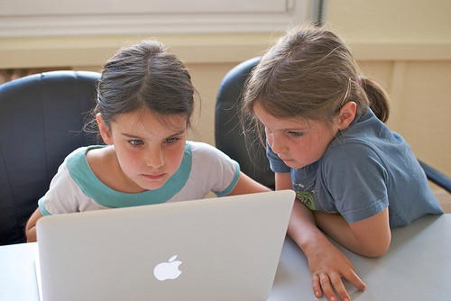
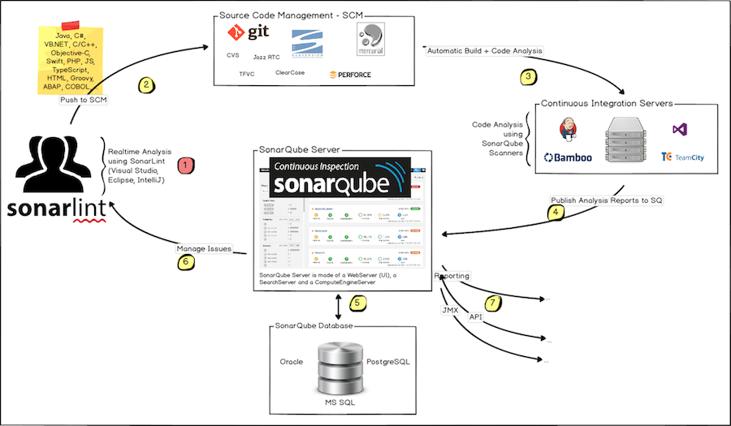

layout: true
class: center, middle, inverse
name: inverse

course: Secure Software Development
title: 08 Source Code Analysis
course: Secure Software Development
author: Jonathan Knudsen
email: jonathan.knudsen@duke.edu

---

# {{title}}

{{course}}

{{author}}

{{email}}

.copyright[


This work is licensed under a [Creative Commons Attribution-ShareAlike 4.0 International License](http://creativecommons.org/licenses/by-sa/4.0/).
]

---
layout: false

# Outline

- Context

- grep is Good, but Not That Good

- Back to Compilers

- Workshop: Run SonarQube

- Good News

- Bad News

- Workshop: Analyze a Project

- Strategy

---
template: inverse

# Context

## Where are we?

---

# Quick Review

- Software vulnerabilities have three flavors

 1. Design
 
 1. Configuration
 
 1. Code

- SDLC helps you find and fix more bugs earlier

- We are in the "more testing and better testing" part of the SDLC

 - Focused on code vulnerabilities here

---

# How Developers Find Bugs

.float[.image-50[]]

- Eyeballs: just read through the source code and look

- Code reviews: the development team reviews code separately or together

- Pair programming: two developers create code together

- But developers are expensive and slow

---
template: inverse

# grep is Good, but Not That Good

---

# First Attempt: grep

.float[.image-40[]]

- A _checker_ finds a particular kind of problem

- For example, a checker to find `goto`, or `strcpy`, or anything else dangerous

```bash
grep -r goto src
```

- Easily broken

 - Fooled by a #DEFINE in a .h file
 
 - Fooled if the build system pulls source from somewhere else

---

# More Seriously: lint and gcc

- `lint` was a standalone tool that would tell you about uninitialized variables, calls to deprecated functions, formatting conventions, etc.

- Most features eventually rolled into `gcc`

---

# But What About

- Different code paths

- Interactions across different files / modules

- Data flow or taint analysis

---
template: inverse

# Back to Compilers

---

# Yikes

- Building the code is one way to know exactly what's in it

- So...build an AST and maybe a CFG, then analyze that

 - You get to follow data, look at control flows

---
template: inverse

# [Static Analysis With Coverity](https://prodduke-my.sharepoint.com/:p:/g/personal/jk471_duke_edu/EXag1OiBIUxEqpCSvCXw_qkBhAd50NzyzmE5Z9RBpweTXg?e=EHHhIT)

## Slides 7-18, 22-25, 32-44

Big thank you to Rody Kersten, https://rodykersten.github.io/

---
template: inverse

# Workshop: Installing Source Analysis

---
template: inverse

# Good News

---

# Friendly to Developers

- Can show the exact line of code where the issue occurs

 - Can also show "supporting events," which are the bits of code leading up to the issue

- Some voodoo enables tracking issues even as the repository is changing

---

# Typical Architecture

.center[.image-90[]]

---

# Nice Integrations

- Integrate to SCM for automatic runs

- Assign issues to developers based on SCM commits

- Integrate to issue tracker (JIRA)

 - But many people don't. Why? Too many issues

- Desktop component, and shifting left

---

# Can Succeed Without a Strong Security Program

- Source analysis can be implemented by a development team

- Results are used by the development team

- Does not require working with other teams, which increases its chances of success

---
template: inverse

# Bad News

---

# Still Requires Manual Work

- Somebody still has to review the output of your source analysis

- Decide what to do _for each issue_

- False positives are a fact of life

- Keeping FP below 10% is "good"

---

# Too Many Languages

- Each language is different

- Each compiler is different!

 - C is not the same C everywhere

- Java and C# are special cases

- Each web application framework must be explicitly supported

- Interpreted languages are hard

---
template: inverse

# Workshop: Build Jitsi

---
template: inverse

# Strategy

---

# Automate, Like Everything Else

- If you automate, you can see how you're doing over time

- If you automate, you won't forget to run it

- If you automate, it'll still happen if your expert gets hit by a bus

---

# Give it Teeth

- Break the build!

- Halt shipping!

- Do this by defining policies and sticking to them

 - In SonarQube, "Quality Gates"

---

# No New Bugs

- Let's say you have 10k or 100k lines of code and you've never run source analysis

- You'll get lots of issues

- Do you take a year off so your development team can work through all the issues?

- Of course not

- Usually, take the initial run as a baseline, and use a policy of "no new bugs"

- And make a plan to burn down the baseline over time...but this sometimes won't happen

---
template: inverse

# And...Coverity SCAN

https://scan.coverity.com/

---
template: inverse

# Workshop: Configure Ant Analysis for Jitsi


