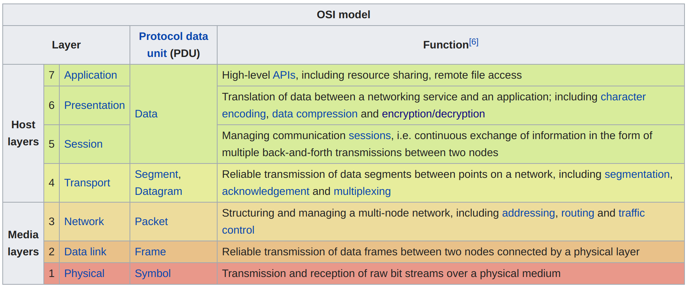
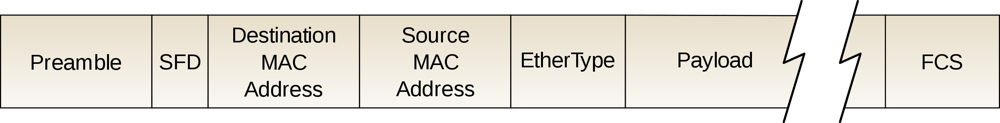
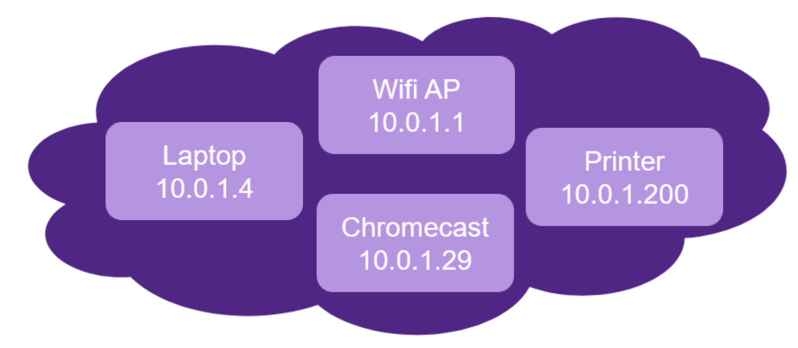
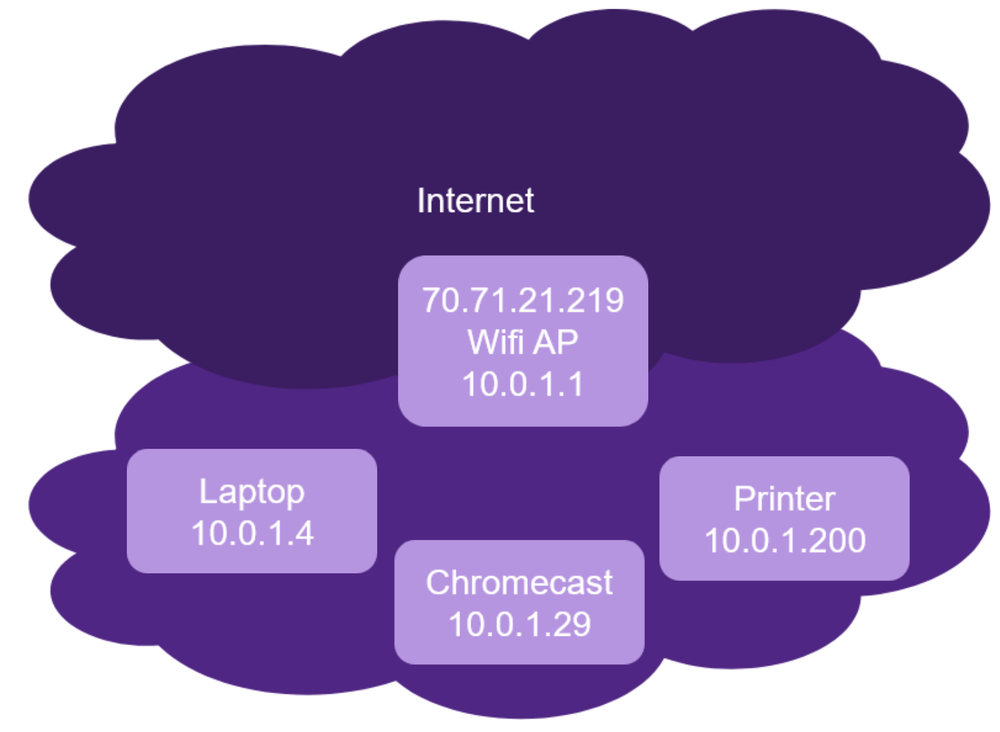
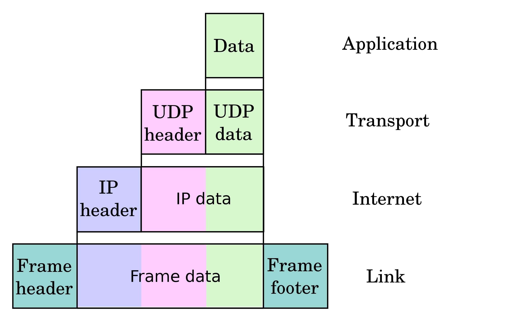
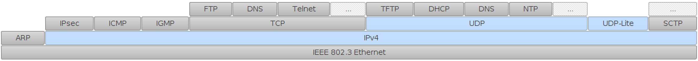
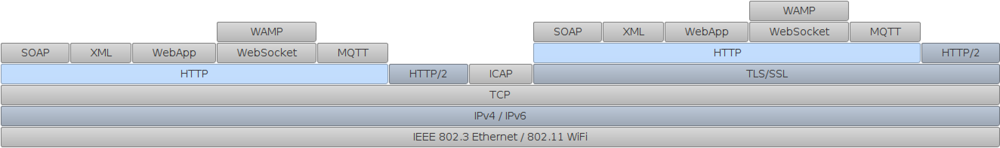
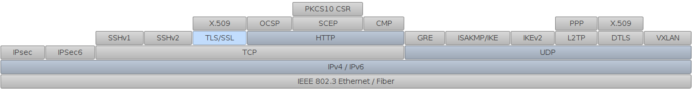
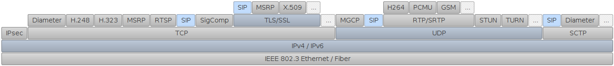

name: inverse
layout: true
class: center, middle, inverse

course: Secure Software Development
title: 10 Networking
author: Jonathan Knudsen
email: jonathan.knudsen@duke.edu

---

# {{title}}

{{course}}

{{author}}

{{email}}

.copyright[

This work is licensed under a [Creative Commons Attribution-ShareAlike 4.0 International License](http://creativecommons.org/licenses/by-sa/4.0/).
]

---
layout: false

# Outline

- Layers

- Bits on a Wire

- Demonstration: Ethernet Frames

- IP

- Close Relatives of IP

- UDP

- TCP

- Demonstration: DNS and HTTP

- NAT

- Workshop: Wireshark

---
template: inverse

# Layers

---

# Don't Learn This

.center[.image-80[]]

- https://en.wikipedia.org/wiki/OSI_model

---

# Learn This

.float[.image-50[]]

- The _concept_ of layers is crucial

- Layer don't know much about each other

 - Can swap out various layers as necessary
 
 - For example, use Wifi instead of Ethernet
 
 - For example, substitute IPv6 for IPv4

- Other useful metaphors

 - Envelopes within envelopes
 
 - Russian nesting dolls

---
template: inverse

# Bits on a Wire

---

# Ethernet

.center[.image-100[]]

- https://en.wikipedia.org/wiki/Ethernet_frame

- Bits on a wire

- Every Etherent adapter has a MAC address, for example `94:e9:79:b0:0b:2b`

 - Assigned at manufacture time

 - First three bytes are a manufacturer code (see https://aruljohn.com/mac.pl)

---

# Receiving and Sending

- Receiving

 - Listen on the wire, pick up frames that have your MAC in the destination

 - Used to be a shared medium

 - Can use _promiscuous mode_ to pick up all frames on the wire

- Sending

 - Try to write out a frame
 
 - If a collision is detected, wait a random amount of time and try again

---

# WiFi Uses the Same Frames

- Definitely some magic first

 - Radio stuff
 
 - Joining a network

- But after that, looks very much like Ethernet

---

# What's My MAC?

- `ifconfig` on Linux lists your network adapters (NICs)

 - Real and imaginary (virtual)
 
 - See MAC addresses, IP addresses and other information

- `ipconfig` on Windows

---
template: inverse

# Demonstration: Ethernet Frames

---

# Wireshark

- Tool for examining network traffic

 - Formerly Ethereal
 
 - Command-line equivalent is `tshark`
 
 - Many Linuxes will have `tcpdump` available

- Screen areas

 - Frames at the top
 
 - Frame dissection in the middle
 
 - Bytes on the wire at the bottom

- Can _dissect_ more than 1,300 protocols

---
template: inverse

# IP

---

# Internet Protocol (IP)

- [RFC791](https://tools.ietf.org/html/rfc791)

- Designed so any machine in the world could communicate with any other machine

- Still the backbone of the Internet as we know it

- Messy, organic growth over many years

- IPv4 is the original

- IPv6 makes numerous improvements, but adoption has been slower than expected

- Based on _packets_ or _datagrams_ that travel throughout the network from _source_ to _destination_

- Designed to be resilient in the face of partial failures

- No guarantees about when packets arrive, whether they arrive at all, or the order in which they arrive

---

# IP Addresses and Networks

- Addresses are four bytes, commonly expressed in _dot notation_ with decimal numbers
 
- _Private networks_

 - 10.0.0.0 to 10.255.255.255
 - 172.16.0.0 to 172.31.255.255
 - 192.168.0.0 to 192.168.255.255

- Can refer to an entire network using an address and a _netmask_

 - Netmask refers to which parts of the address are constant

 - `inet 10.0.1.14  netmask 255.255.255.0`

- A newer way is [CIDR](https://en.wikipedia.org/wiki/Classless_Inter-Domain_Routing)

 - Specify an address, then the number of bits used for the netmask
 
 - `10.0.1.0/24`

---

# A Glimpse of My Home Network

&nbsp;

&nbsp;

&nbsp;

&nbsp;

.center[.image-60[]]

---

# A Router

.center[.image-60[]]

---

# The Sky is Falling, Again

- The ozone layer, ocean levels, carbon footprint...

- ...and now IPv4 address exhaustion

- They're only 32 bits, so you do the math

 - I'll do the math: 4,294,967,296 addresses
 
 - And some blocks are unusable because of how they're allocated
 
 - _Not enough_

---

# IPv6 Was Going to Save Us

- Designed to replace IPv4 and make up for its shortcomings

- https://en.wikipedia.org/wiki/IPv6

- 128-bit addresses, theoretically 2 x 10^138 addresses

- Authentication and encryption features available

- A slow conversion

---
template: inverse

# Close Relatives of IP

---

# ARP: Mixing Up Layers Already

- Protocol for figuring out which MAC address corresponds to which IP address

- Uses _broadcast_ MAC address

---

# And DHCP, for Getting an IP Address

- Uses _broadcast_ IP adress, with 0.0.0.0 as the source

- Requires a DHCP server running in the network

- Supplies an IP address, netmask, gateway, and DNS servers

- This happens every time you connect to a Wifi network, for example

- (Show _dump-03.pcapng_)

---
template: inverse

# UDP

---

# Partway There

- So IP lets us get data from any computer to any computer

- How do you talk between specific applications?

- Enter the concept of _port_

---

# UDP

- A pretty thin layer on top of IP

- Adds a checksum

- But still no guarantees about delivery: timing, order, whether it happens

- Adds a port number

 - Actually, both a _source_ port and a _destination_ port

- Applications can tell the OS they are interested in any packets arriving at a certain port

 - OS keeps a list and forwards packets as they come in

- Some well-known UDP ports

 - 53 - DNS
 
 - 151 - SNMP

---

# Layers, Again

.footnote[[en:User:Cburnett](https://en.wikipedia.org/wiki/User:Cburnett) original work, colorization by [en:User:Kbrose](https://en.wikipedia.org/wiki/User:Kbrose)]

- https://en.wikipedia.org/wiki/Internet_protocol_suite

.center[.image-60[]]

---

# TCP

- What if you need reliable, stream-based communication?

- Enter TCP

- Like UDP, has the concept of source port and destination port

- However, attempts to provide in-order, reliable delivery

- Three-way handshake: SYN, SYN-ACK, ACK

 - Sets up some counters for the conversation

- (Show _dump-02.pcapng_)

---

# Most of the World is Built on TCP or UDP

&nbsp;

&nbsp;

&nbsp;

.center[.image-100[]]

---

# Web Protocol Stack

&nbsp;

&nbsp;

&nbsp;

.center[.image-100[]]

---

# VPN-Related Stack

&nbsp;

&nbsp;

&nbsp;

.center[.image-100[]]

---

# VoIP Stack

&nbsp;

&nbsp;

&nbsp;

.center[.image-100[]]

---
template: inverse

# Demonstration: DNS and HTTP

---
template: inverse

# NAT

---

# NAT Saves the Day

- IPv6 was supposed to save the Internet, but NAT did it instead

- Network Address Translation

.center[.image-80[]]

---

# Keeping Lists

- Rewrite source IP address on outgoing packets

- Keep track of which internal IP is talking to which IP and port

- Rewrite destination IP address on incoming packets

- Magic!

---
template: inverse

# Workshop: Wireshark

---

# Where Do You Want to Install It?

- You can put it on your laptop if you wish

- If you'd rather not, you can use a Windows VM from vcm.duke.edu

---

# Display Filters

- Use a protocol name as a filter

 - Mostly as you would expect: `http`, `dns`

 - Some oddballs: `ssl` for TLS, `bootp` for DHCP
 
- Can be specific about fields: `ip.dst==10.0.1.7`

- Can build filters with `&&` and `||`

---

# Saving Subsets

- __File__ > __Export Specified Packets...__

- Can export just displayed packets

- Can mark packets (Ctrl-M) and export those

---

# So Many Other Features!

- Follow stream

- Capture filters

- __Statistics__ menu

- VoIP stuff in __Telephony__ menu

- Right click on things!

---
template: inverse

# Loose ends

---

# Ping and ICMP

- Ping is a very useful tool for determining if two devices can communicate

- Uses the ICMP protocol

- `ping` command on Linux and Windows

 - Linux command pings indefinitely
 
 - Window does four and then stops

- `ping6` for the corresponding thing in the IPv6 world

---

# Insertion Points

- To capture traffic properly, you need the right visibility

- Whenever you want to capture traffic, take some time to determine the right _insertion point_

- WiFi

 - Probably you need to be listening on the WiFi AP
 
 - You can configure your laptop to be a WiFi AP, then use Wireshark to capture

- Ethernet

 - Modern switches won't allow you to see traffic from other devices
 
 - You can set up your laptop as a router and capture traffic that way
 
 - You can use a _port-mirroring_ switch to insert yourself between a device and the rest of the network

---
class: whitey
background-image: url(images/cybersecurity-halloween.png)

# Happy Halloween!
