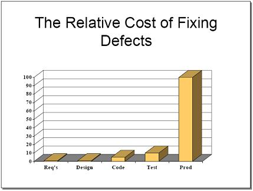
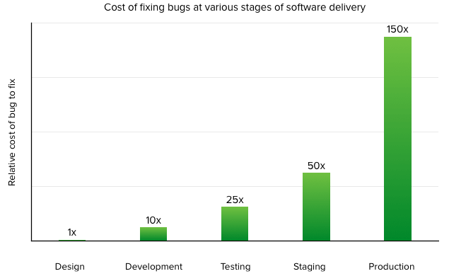
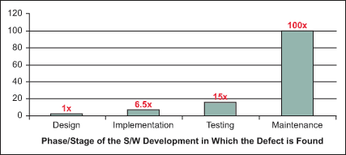
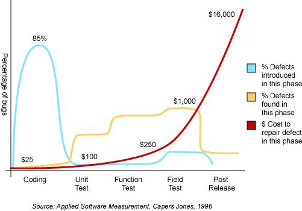
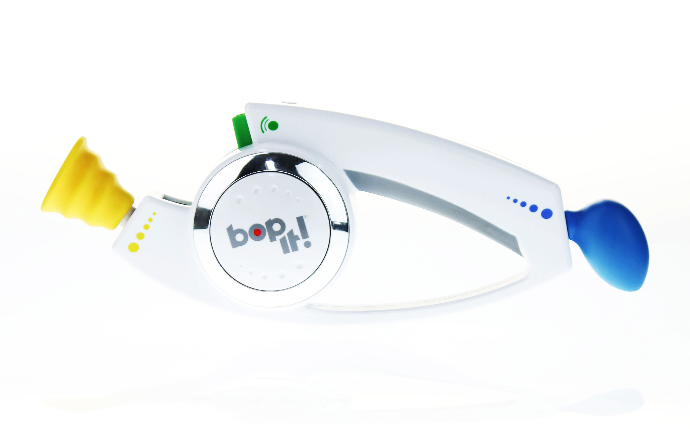
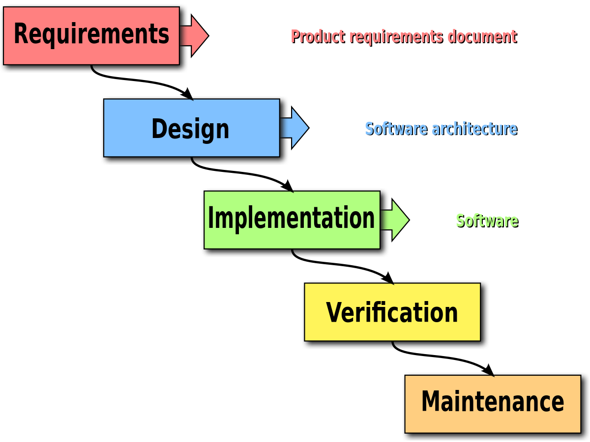
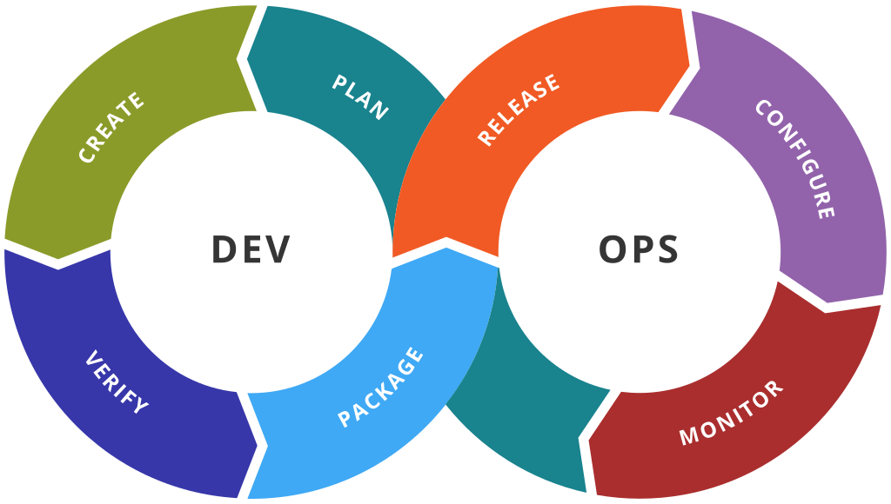
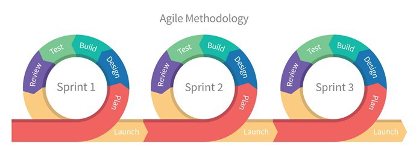

layout: true
class: center, middle, inverse
name: inverse

course: Secure Software Development
title: 02 Secure Development Life Cycle
course: Secure Software Development
author: Jonathan Knudsen
email: jonathan.knudsen@duke.edu

---

# {{title}}

{{course}}

{{author}}

{{email}}

.copyright[

This work is licensed under a [Creative Commons Attribution-ShareAlike 4.0 International License](http://creativecommons.org/licenses/by-sa/4.0/).
]
---
layout: false

# Outline

- Anyone Can Cook

- Coders Gonna Code

- A Bug's Life

- Who Cares?

- Nothing New Under the Sun

- SDLC

- Let's Revisit the World with Unicorns

- Policies

---

template: inverse

.center[]

---

# Typical Timeline

- Light bulb!

- Write requirements!

- Make prototype!

- Release party!

--

- but...

--

- Attacker discovers vulnerability

- Attacker exploits vulnerability

- _[Cue Mozart Requiem, Dies Irae](https://www.youtube.com/watch?v=0T7eMctuJLQ)_

---

template: inverse

# Excerpt: [How Software Goes Bad](https://prodduke-my.sharepoint.com/:p:/g/personal/jk471_duke_edu/EZdccrwlFadJsBDmdqliNwMBEmwVJ7U3F57NXR_l2A2DnA?e=nXeMQZ)

Slides 1 - 11

---

template: inverse

# Excerpt: [​Coders Gonna Code](https://prodduke-my.sharepoint.com/:p:/g/personal/jk471_duke_edu/EaQ9hkP8UTJElXDK2OUh24oBuhKVvrJ9mxN3_3F2zzNXXg?e=PTP1DE)

From _Harness Your Robot Army for Total Vulnerability Management_

Slides 14 - 20

---

template: inverse

# Excerpt: [Security is Easy](https://prodduke-my.sharepoint.com/:p:/g/personal/jk471_duke_edu/EdADzmckCAJPjqCwtm4rDz8Bojw9YoIAMb6_hZNCFP115w?e=Ay0nP7)

From _Get Cozy With Fuzzing_

Slides 3 - 9

---

template: inverse

.float[.image-40[]]

# Excerpt: [A Bug's Life](https://prodduke-my.sharepoint.com/:p:/g/personal/jk471_duke_edu/EaAKw9sXj9JDsO7fxT2U04UBZXW2Vu7YK8UEzppHEjaBtg?e=a4mN42)

From _Know What You Don't Know and Minimize Your Risk_

Slides 18 - 20

---

template: inverse

# Who Cares?

---

# Money

- In the short term

 - It is _faster_ and _cheaper_ to create high-risk software
 
 - It is _slower_ and _more expensive_ to create lower-risk software

- In the long run

 - You save money by fixing bugs earlier, especially before product release
 
 - You might avert disaster

---

.float[.image-40[]]

# Hockey Sticks

.image-30[] .image-30[]

.image-30[] .image-30[]

---

# The Intangibles that Depend on Software

- Reputation

- Privacy

- Safety

- Life

- ...

- You cannot measure these in money

- People always think you are Chicken Little or the Boy Who Cried Wolf

---

template: inverse

# Nothing New Under the Sun

## Development methodologies

---

# Fundamentals

- Decide what to build

- Decide how to build it

- Build it

- Test it

.center[.image-60[]]

---

# [Waterfall](https://en.wikipedia.org/wiki/Waterfall_model)

.center[.image-60[]]

.footnote[By Peter Kemp / Paul Smith - Adapted from Paul Smith's work at wikipedia, CC BY 3.0, https://commons.wikimedia.org/w/index.php?curid=10633070]

---

# Twist It

.center[.image-70[]]

---

# Bop It

.center[.image-100[]]

---

# And Buzzwords _Du Jour_

.float[.image-50[]]

- DevOps

- DevSecOps

- Shift left

---

template: inverse

# Secure Development Life Cycle (SDLC)

---

# Secure Development Life Cycle (SDLC)

- A.k.a. Secure Software Development Life Cycle (SSDLC)

- A.k.a. Secure Development Lifecyle (SDL)

- Microsoft
 
- Cisco
 
- Anyone else who is serious about software development (should be everybody)

- Key points of SDLC:

 - Security is part of _every_ stage

 - More and better testing

 - And some extra stuff at the beginning and end

---

# Fits Any Shape Development

.center[.image-50[]]

---

# Microsoft SDL

- Excellent public resource

- https://www.microsoft.com/en-us/securityengineering/sdl

- Your book describes an earlier version

- Previously, was presented as a sequence

- Now just _practice areas_

---

# Microsoft SDL Practice Areas

1. Provide Training

1. Define Security Requirements

1. Define Metrics and Compliance Reporting

1. Perform Threat Modeling

1. Establish Design Requirements

1. Define and Use Cryptography Standards

1. Manage the Security Risk of Using Third-Party Components

1. Use Approved Tools

1. Perform Static Analysis Security Testing (SAST)

1. Perform Dynamic Analysis Security Testing (DAST)

1. Perform Penetration Testing

1. Establish an Incident Response Process

---

# Cisco SDL

- Another excellent public resource

- https://www.cisco.com/c/en/us/about/trust-center/technology-built-in-security.html#~stickynav=2

- Part of a larger context ("The Trust Center")

---

template: inverse

# Let's Revisit the World with Unicorns

Because...unicorns!

---
class: whitey
background-image: url(images/unicorn.png)

# In a World With Unicorns

- The organization recognizes the need for security  and supports it at the highest level

- CISO or CIO has product security, IT security,  and incident response

- Has authority to create and maintain  policies and procedures that apply across  the whole organization

---

template: inverse

# Policies

---

# Policies

- Just so you write down somewhere the way things should be

- Divided again along the lines of IT security, product security, and IR

- For example, part of an IT security policy:

 - "Laptop screen should lock after 2 minutes of inactivity."
 
 - "Users can install only IT-approved applications."

- For example, part of a product security policy:

 - "We won't release the product if we have any unresolved P1 or P2 bugs."
 
 - "We should get no critical or severe findings from a static analysis tool."

- For IR

 - "We will respond to any report of a security bug in our product within 48 hours."

 - Etc.

---

# Policies Imply Measurement

- And measurement is tricky

- Back to this "how secure is it" question

- One way is to define policy around test tool results

- One way (not a great way) is by bug severities

 - This happens often
 
 - Bug severities are somewhat arbitrary

---

# Microsoft SDL Revisited

- (1) Provide Training

- __Policy__

 - (2) Define Security Requirements (3) Define Metrics and Compliance Reporting

 - (4) Perform Threat Modeling (5) Establish Design Requirements

 - (6) Define and Use Cryptography Standards

- __More and Better Testing__

 - (7) Manage the Security Risk of Using Third-Party Components (8) Use Approved Tools

 - (9) Perform Static Analysis Security Testing (SAST) (10) Perform Dynamic Analysis Security Testing (DAST)

 - (11) Perform Penetration Testing

- (12) Establish an Incident Response Process

