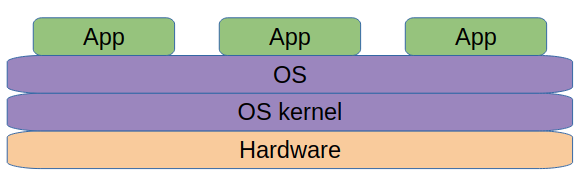
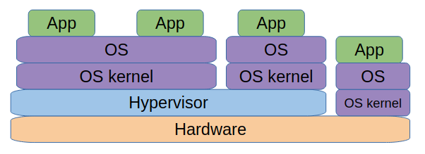
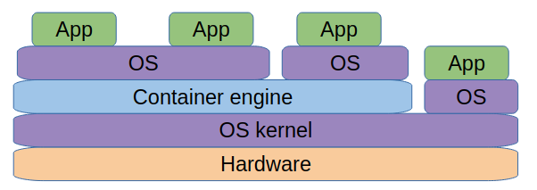
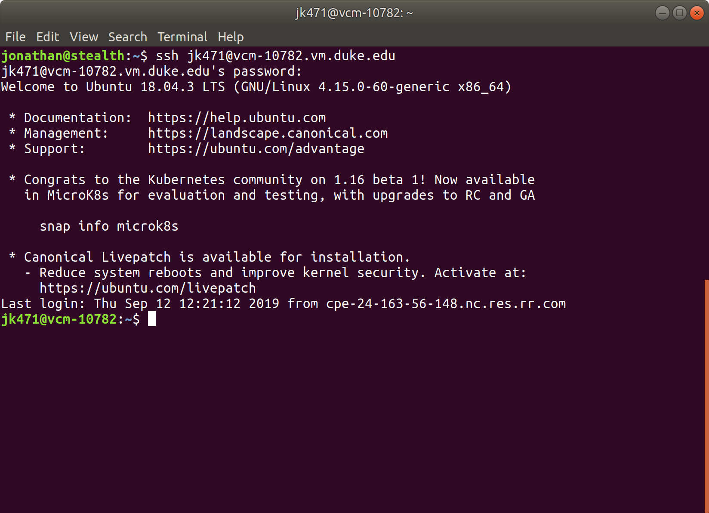

name: inverse
layout: true
class: center, middle, inverse

course: Secure Software Development
title: 02w Getting Around Linux
author: Jonathan Knudsen
email: jonathan.knudsen@duke.edu

---

# {{title}}

{{course}}

{{author}}

{{email}}

.copyright[


This work is licensed under a [Creative Commons Attribution-ShareAlike 4.0 International License](http://creativecommons.org/licenses/by-sa/4.0/).
]

---
layout: false

# Outline

- A Little Bit About Virtualization

- Get a Virtual Machine (VM)

- Command Line: Directories and Files

- Command Line: Installing Commands

---

template: inverse

# A Little Bit About Virtualization

---

# How Things Looks Normally

.center[.image-80[]]

---

# Virtual Machines

.center[.image-80[]]

---

# Containers

.center[.image-80[]]

---

template: inverse

# Metasploit Demonstration

---

template: inverse

# Get a Virtual Machine (VM)

---

# Duke Makes This Easy

- Same idea as the big cloud providers

- https://vcm.duke.edu/

- Log in

- Reserve a VM

- Choose Ubuntu 20

- Bob's your uncle

---

# Get Into Your VM

```
ssh jk471@vcm-10782.vm.duke.edu
```

- ...but of course substitute your NetID and your machine address

- Guess what? SSH is a hybrid protocol that provides authentication and encryption

- Type your regular password to connect. (No characters will appear.)

- The first time you connect you will probably get a warning. It's OK.

- Shut down your SSH session with `exit`

- If you're on Windows, get `putty`

---

.center[.image-80[]]

---

template: inverse

# Command Line: Directories and Files

---

# Directories

- List your current directory: `ls`

 - More details: `ls -l`
 
 - With human-readable sizes: `ls -lh`
 
 - Show hidden files too (files that begin with `.`): `ls -lah`
 
- Show your current directory: `pwd`

- Move to a different directory: `cd Documents`

 - Can nest directories: `cd Documents/duke`
 
 - Paths that start with `/` are _absolute_: `cd /tmp`

- Make a directory: `mkdir oceanmaster`

 - Make multiple directories: `mkdir -p oceanmaster/secret/keys`
 
- Remove an empty diretory: `rmdir oceanmaster`

 - Remove a directory and all its contents (careful!): `rm -rf oceanmaster`

---

# Copying and Moving

- Copy a file: `cp hello.txt hello2.txt`

- Move or rename a file or directory: `mv oceanmaster om`

 - Move file to directory: `mv hello.txt oceanmaster`
 
 - Move and rename file `mv hello.txt oceanmaster/h.txt`

- Recursively copy a directory: `cp -r oceanmaster om2`

---

template: inverse

# Command Line: Running Stuff, Installing Stuff

---

# Life and Death

- Run a command in the background: append a `&`

 - For example, `node with-tls.js &`

- List running processes: `ps`

 - Include everything: `ps aux`
 
 - Add `grep` to find something: `ps aux | grep node`

- Kill a process: `kill <pid>`

---

# Flexing

- Sometimes you need _root_ or _superuser_ privileges

 - Access to some files and directories
 
 - Access to network ports below 1024 (like 80 for HTTP or 443 for HTTPS)

- Use `sudo` to make it happen

 - You'll have to type your password again

- Start a server with port 80 or 443: `sudo node with-tls.js &`

- Kill a process belonging to root: `sudo kill 2279`

---

# Installing New Software

- When you try to use something you don't have, usually you get a helpful message:

```
jk471@vcm-10782:~$ screenfetch

Command 'screenfetch' not found, but can be installed with:

apt install screenfetch
Please ask your administrator.
```

- You need to be root: `sudo apt install screenfetch`

 - Or to skip the prompt: `sudo apt install -y screenfetch`

- Uninstall: `sudo apt remove -y screenfetch`

---

# Editing Text

- `vi` and `emacs` are good editors, but if you don't know them, you probably don't want to learn them

- `nano` is pretty friendly
