name: inverse
layout: true
class: center, middle, inverse

course: Secure Software Development
title: 04 Cryptography 1
course: Secure Software Development
author: Jonathan Knudsen
email: jonathan.knudsen@duke.edu

---

# {{title}}

{{course}}

{{author}}

{{email}}

.copyright[


This work is licensed under a [Creative Commons Attribution-ShareAlike 4.0 International License](http://creativecommons.org/licenses/by-sa/4.0/).
]

---
layout: false

# Outline

- Introduction

- Hashes

- Hashes and Passwords

- Ciphers

- Authenticated Encryption with Additional Data

- Key Management

- Random Numbers

---

# Cryptography

- is math

- Very very useful in computer security

- Mostly based on problems that are hard to solve

- Directly applies to the C and I of CIA

 - _Ciphers_ are good for confidentiality
 
 - _Hashes_ and _signatures_ are good for integrity

- Crypto is also great for authentication and nonrepudiation

---

# Here Be Dragons (1 of 3)

.center[.image-60[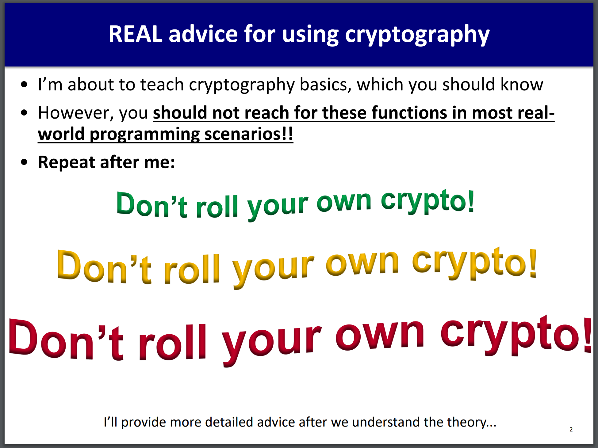]]

.center[From [Tyler Bletsch's ECE 590 Computer and Information Security](http://people.duke.edu/~tkb13/courses/ece590-sec/)]

---

# Here Be Dragons (2 of 3)

- _Implementing_ cryptography is hard to do correctly

- _Using_ cryptography is hard to do correctly


.bq[
Summary: if you're going to use RSA encryption, the security of RSA itself is probably the least of your concerns. The route from "RSA" to "secure communication system" is a bit like something out of a twisted combination of Greek mythology and the Christian Bible: a maze with a thousand wrong turns, each of which leads to a place that looks exactly like where you wanted to go--but taking any wrong turn will damn you to an eternity of torture and torment.
]

.pull-right[[Jeffrey Coffin on Stack Overflow](https://stackoverflow.com/questions/10214463/how-safe-and-secure-is-rsa)]

---

# Here Be Dragons (3 of 3)

.float[.image-30[]]

- If you can't implement your own cryptography, where do you get it?

 - Somewhere you trust
 
 - How do you know your supplier didn't mess it up?
 
 - We'll talk about software supply chain later

- If it's a twisty maze to use cryptography, how do you do it?

 - Very carefully
 
 - Use an SDLC, of course
 
 - Industry best practices

 - Design reviews, threat modeling, testing, etc.

---

# Cryptography Helps with Security Features

- Cryptography really helps when you are adding features to protect confidentiality and integrity

- Improving overall security of software, i.e. finding and fixing vulnerabilities, is software security

- We will get there

---
template: inverse

# Hashes

---

# Hashes

- A.k.a. _message digests_

- Take an arbitrary amount of input data, produce a small fixed-length hash value

- Sometimes called a "fingerprint" of the input data

- Important properties:

 - If even a single bit of the input data changes, you get a different hash

 - It is very hard to manipulate input data to product a specific hash
 
 - Hash does not reveal anything about the input data

- Of course two inputs might produce the same hash (a _collision_), but it is unlikely

 - Unless the algorithm has a flaw

---

# Using Hashes to Verify Integrity

- For a big file, a web site will sometimes publish a hash

- After you download the file, calculate the hash yourself and compare with the published value

 - Verify that the file was correctly downloaded
 
 - https://linuxmint.com/verify.php for example

---

# Hash Algorithms

- They come and go, like Karma Chameleon

Names          | Size (bits)        | Born | Died | Notes
------         | ----               | ---- | -----
MD4            | 128                | 1990 | 1995 |
MD5            | 128                | 1991 | 2005 |
SHA / SHA-0    | 160                | 1993 | 1993 |
SHA-1          | 160                | 1995 | 2010 | https://shattered.io/
SHA-2          | 224, 256, 384, 512 | 2001 |      |
SHA-3 / Keccak | 224, 256, 384, 512 | 2015 |      |

---

# See SHA256 In Action

- https://github.com/in3rsha/sha256-animation

---
template: inverse

# Hashes and Passwords

---

# Passwords are Poop 💩

- This is well-traveled ground

- People choose bad passwords

- People write them down in dumb places

- Computers are good at brute-forcing

- Password recovery mechanisms are frequently bad

---
class: whitey
background-image: url(images/hawaii-oops-smaller.png)

.footnote[[Full story at Yahoo](https://finance.yahoo.com/news/password-hawaii-emergency-agency-hiding-200746479.html)]

---

# Password Storage

- Storing passwords in plaintext is dangerous and irresponsible

- Can store hashes instead

 - Actually a help to confidentiality rather than integrity here

- Upon login, hash the user's typed password, then compare to stored hash

---

# But People Choose Dumb Passwords

- If I have a file full of password hashes, I can use a _dictionary attack_

 - "Dictionary" contains commonly-used passwords
 
- Hash every word in the dictionary, see if any stored hash matches

- Optimize this with a _rainbow table_, where I precompute hashes for all the words in the dictionary

---

# Slow Down Hashing with Salt

- Just add another number, _salt_ into the hash

 - It's infeasible to make a rainbow table for every possible salt for every dictionary password

- Linux does this, for example

- In _/etc/shadow_:

```
jonathan:$6$yePftFNN$eAmffZhWLspPx6NwUWa./Hiewqufc6WfFQ.GnmFnayq.OghBthc1ficb6/2pJzJ5aK51seQ2gIsFPiQ8jvoxV.:18084:0:99999:7:::
```
- `man shadow`
 
- `man crypt`

 - `$id$salt$encrypted` 

---

# Other Good Stuff for Authentication

- Not related to hashes, but still...

- Split of _/etc/passwd_ and _/etc/shadow_

- Rate limiting and account lockouts

 - But make sure your recovery mechanism is not stupid
 
- _Why is authentication boolean?_

 - Doesn't it make sense that some operations require more authentication than others?
 
 - For example, your bank might define a threshold and require 2FA for transfers above that amount

---
template: inverse

# Ciphers

---

# Ciphers

- Some useful terms

 - _Plaintext_ is just normal, usable data
 
 - _Ciphertext_ is an unreadable mess

 - _Encryption_ is when a cipher transforms plaintext to ciphertext

 - _Decryption_ is the opposite, when the cipher transforms ciphertext back to plaintext

- Ciphers generally help with _confidentiality_

---

# rot13

- Encryption algorithm

 - For each letter of plaintext, transform to the 13th later letter, wrapping as necessary
 
 - For example, `a` encrypts to `n`
 
 - For example, `s` encrypts to `f`
 
 - https://rot13.com/
 
- Decryption algorithm

 - Same as encryption, except transform to 13th prior letter

---

# Caesar Cipher

- State of the art about 2,000 years ago

- Actually a special case of a _substitution cipher_: https://en.wikipedia.org/wiki/Substitution_cipher

- Same as rot13, but change the number

- rot13 is a special case of Caesar cipher, with the number 13

- The number serves as a _key_

 - The ciphertext depends on the key
 
 - You need the key to decrypt
 
 - Ciphertext preserves confidentiality (against very unsophisticated adversaries)

---

# Weaknesses

- Small key space (1 <= n <= 25)

 - Easy to _brute force_, i.e. try every key and see if it decrypts properly

- Only works for plaintext composed of English alphabet

- Same plaintext always encrypts to the same ciphtertext

 - Allows for _cryptanalysis_ by looking at letter frequencies

---

# Real Ciphers

- Can handle arbitrary input data

- Use larger keys

- Resist brute forcing and cryptanalysis

---

# Symmetric and Asymmetric Ciphers

- _Symmetric_ ciphers use the same key for encryption and decryption

 - Caesar cipher is symmetric

- _Asymmetric_ ciphers use a pair of keys that are mathematically related

 - A _public_ key can be shared with the world
 
 - A _private_ key must be protected

---

# Block and Stream Ciphers

- _Block_ ciphers transform a fixed-size block of information at a time

 - 64 bits or 128 bits are typical block sizes
 
 - Plaintext or ciphertext must be divided into blocks before encryption or decryption
 
 - A _padding_ scheme fills out plaintext to an even number of blocks for encryption, and restores the original length after decryption 

- _Stream_ ciphers transform a single byte at a time

 - Caesar is a stream cipher
 
 - Some magic (later) can make any block cipher function as a stream cipher

---

# Padding

- Plaintext will not always be a multiple of the block size

- If the last block is incomplete, how do you fill it?

- And we want to restore the plaintext length when decrypting

- PKCS#7 is commonly used (PKCS#5 is PKCS#7 for 8-byte blocks)

.center[.image-60[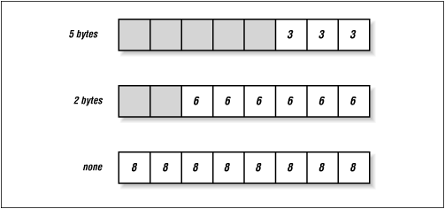]]

---

# Padding Examples

```
        Plaintext: 1
Encoded plaintext: 31
 Padded plaintext: 31:0f:0f:0f:0f:0f:0f:0f:0f:0f:0f:0f:0f:0f:0f:0f

        Plaintext: 12
Encoded plaintext: 31:32
 Padded plaintext: 31:32:0e:0e:0e:0e:0e:0e:0e:0e:0e:0e:0e:0e:0e:0e

        Plaintext: 123
Encoded plaintext: 31:32:33
 Padded plaintext: 31:32:33:0d:0d:0d:0d:0d:0d:0d:0d:0d:0d:0d:0d:0d

        Plaintext: 1234
Encoded plaintext: 31:32:33:34
 Padded plaintext: 31:32:33:34:0c:0c:0c:0c:0c:0c:0c:0c:0c:0c:0c:0c

        Plaintext: 1234567890abc
Encoded plaintext: 31:32:33:34:35:36:37:38:39:30:61:62:63
 Padded plaintext: 31:32:33:34:35:36:37:38:39:30:61:62:63:03:03:03
```

---

# Modes

- A cipher _mode_ determines how plaintext blocks get encrypted and decrypted

- The simplest case is Electronic Code Book (ECB)

- Each block of plaintext gets encrypted to a block of ciphertext

- For example:

.image-100[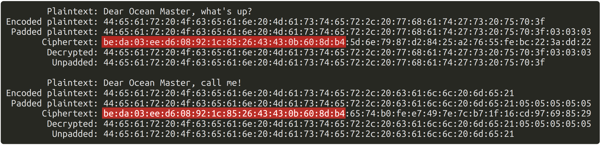]

---

# Cipher Block Chaining (CBC) Mode

.float[.image-50[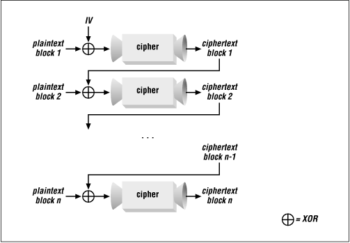]]

- Better for confidentiality

- Plaintext is XORed with previous ciphertext blocks before encryption

- First block is XORed with an _initialization vector_ (IV), which has to be transmitted along with the ciphertext

---

# A Visual Aid

- From http://www.crypto-it.net/eng/theory/modes-of-block-ciphers.html

- Plaintext, ECB, CBC

 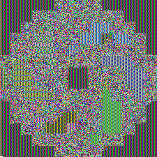 

---

# Counter (CTR) Mode

.center[.image-60[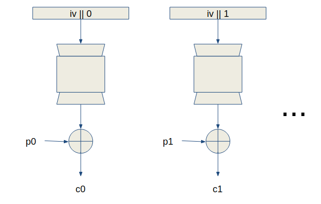]]

.footnote[See also https://www.geeksforgeeks.org/block-cipher-modes-of-operation/]

---

# Cipher Feedback (CFB) Mode

.float[.image-50[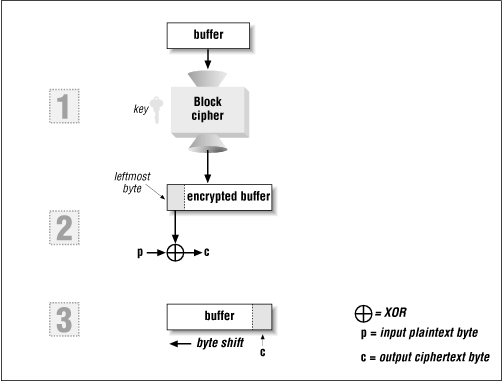]]

- Encrypt buffer

- XOR leftmost bits (8 here) with plaintext bits to get ciphertext

- Left shift buffer

- Fill in on the right side of the buffer with the ciphertext

---

# Using Asymmetric Ciphers

- Encryption performed with one key of the key pair can be decrypted with the other key of the key pair
 
 - For example, Maid Marian encrypts a message with Robin Hood's public key
  
 - Robin Hood should be the only one who can decrypt it, because Robin Hood is the only one with his private key

.center[.image-70[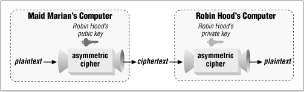]]

- This is good for _confidentiality_, _integrity_, and _authentication_

---

# Nobody Uses Asymmetric Ciphers Like That

- Asymmetric ciphers are slow

- _Hybrid_ systems use symmetric and asymmetric ciphers

 - Use asymmetric ciphers for authentication and setting up a _session_ key
 
 - Use a symmetric cipher with the session key for the rest of the conversation

 - A celebrity hybrid: TLS (coming up next week)

---

# Cipher Algorithms

.small[

Names          | Symmetry   | Block size | Key size              | Born | Died | Notes
------         | --------   | ---------- | ----                  | ---- | ---- | -----
[AES](https://en.wikipedia.org/wiki/Advanced_Encryption_Standard) / Rijndael | Symmetric  | 128 bits   | 128, 192, or 256 bits | 1998 |      | Rijndael supports more key sizes and block sizes
[Camellia](https://en.wikipedia.org/wiki/Camellia_%28cipher%29) | Symmetric  | 128 bits   | 128, 192, or 256 bits | 2000 |      |
[RC4](https://en.wikipedia.org/wiki/RC4) | Symmetric | Stream | 40 - 2048 bits | 1994 | 2014 |
[ChaCha20](https://en.wikipedia.org/wiki/Salsa20) | Symmetric  | Stream | 128 or 256 bits | 2007 | |
[DES](https://en.wikipedia.org/wiki/Data_Encryption_Standard) | Symmetric | 64 bits | 56 bits | 1975 | ~1999 |
[3DES or Triple DES](https://en.wikipedia.org/wiki/Triple_DES) | Symmetric | 64 bits | 56, 112, or 168 bits | 1998 | | Kinda still OK, but better options are available
[RSA](https://en.wikipedia.org/wiki/RSA_%28cryptosystem%29) | Asymmetric | Depends | 1,024 to 4,096 bits | 1977 | |

]

---

template: inverse

# Signatures

---

# Hash + Asymmetric Cipher = Signature

- For authenticated integrity: stronger than just a hash

- Hash input, then encrypt the hash

.center[.image-70[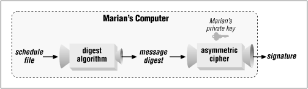]]

---

# Verifying a Signature

- Decrypt the signature with the signer's public key

 - You end up with the hash value

- Recalculate the hash and compare

.center[.image-70[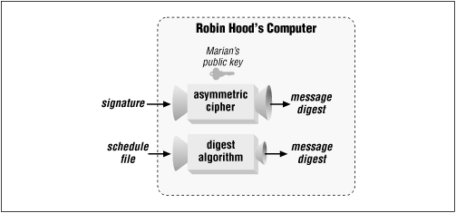]]

---

# Message Authentication Codes (MACs)

- A MAC is just like a signature, but uses a symmetric key

- A MAC is just like a hash, but uses a key as well

- Use the key, with input data, to create the MAC value

- Use the key, with input data, to verify the MAC value

---

template: inverse

# Authenticated Encryption with Additional Data (AEAD)

---

# Meet AEAD

- You can see how cryptographic primitives meet confidentiality, integrity, and authentication requirements

- It can be hard to combine them properly

 - TLS demonstrated some challenges here

- Some cipher modes provide confidentiality and authenticated integrity at the same time

 - This is Authenticated Encryption (AE)
 
 - Sometimes you also need authenticated integrity on unencrypted data (Additional Data, or AD)

- This is Authenticated Encryption with Associated Data (AEAD)

---

# Galois/Counter Mode (GCM)

.image-90[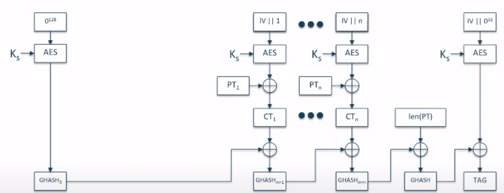]

.footnote[From https://youtu.be/R2SodepLWLg]

---

template: inverse

# Keys

---

# Keys

- Really just numbers

- Usually represented as an array of hexadecimal bytes

- Randomly generated .red[*]

- Key pairs are mathematically related

.footnote[.red[*] More about randomness soon]

---

# Key Management is Always a Bear

.float[.image-50[]]

- Storing keys is a problem

 - How do you store keys on disk so it's hard for an attacker to get them?

- Transmitting keys is a problem

 - How do you transmit keys without an attacker getting them?

- Using keys is a problem

 - While they're in memory, how do you know another process won't steal them?

---

# Key Exchange Protocols

- [Diffie-Hellman](https://en.wikipedia.org/wiki/Diffie–Hellman_key_exchange) (DH) is the one everyone knows

.center[.image-30[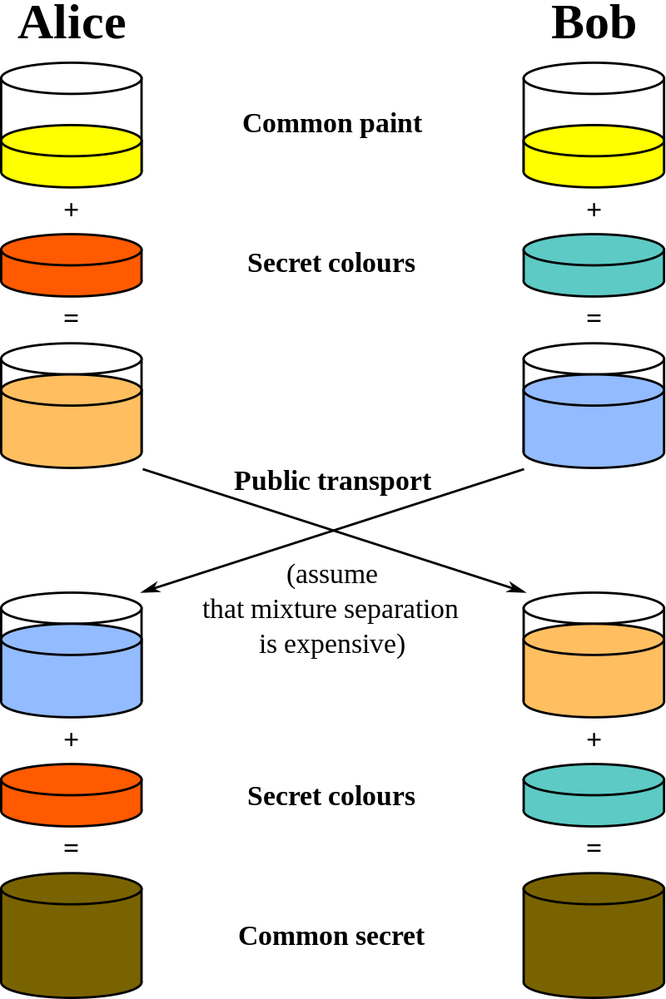]]

---
template: inverse

# Randomness

---

# Randomness

- Another bear

- Keys are generated randomly

- IVs are generated randomly

- Hold your chin, look up at the ceiling, and say "But what does random really _mean_?"

 - Cannot be predicted

- Computers are bad at random

---

# PRNGs

- Computers use _pseudorandom number generators_ (PRNGs)
 
- Given a _seed value_, produce a deterministic sequence of numbers
 
- Calamity frequently occurs

 - Use system clock or some other trivial value as the seed for PRNG
 
 - Simplifies life for attackers: given the approximate time when random numbers were generated, try a limited number of time values as PRNG seeds, maybe guess keys

- Typical usage: use truly random values (_entropy_) for the seed of a PRNG

- Good sources of randomness:

 - People rolling dice
 
 - Radioactive decay

 - Stray radiation in the Universe

- On Linux, _/dev/random_ tries to be truly random...but read the documentation

---

# Randomness Beacons

- https://csrc.nist.gov/Projects/Interoperable-Randomness-Beacons

- https://www.cloudflare.com/leagueofentropy/
 
 - https://developers.cloudflare.com/randomness-beacon/user-guide/private-randomness/

 - https://onezero.medium.com/the-league-of-entropy-is-making-randomness-truly-random-522f22ce93ce

---

# That's a Wrap

- Cryptography is math that helps in implementing security features

- Hashes produce a small fixed-length value from an arbitrary amount of input

- Ciphers use keys to encrypt and decrypt data

- Signatures indicate integrity, backed by somebody's private key

- Key management is the hardest problem

- Random numbers should really be random

